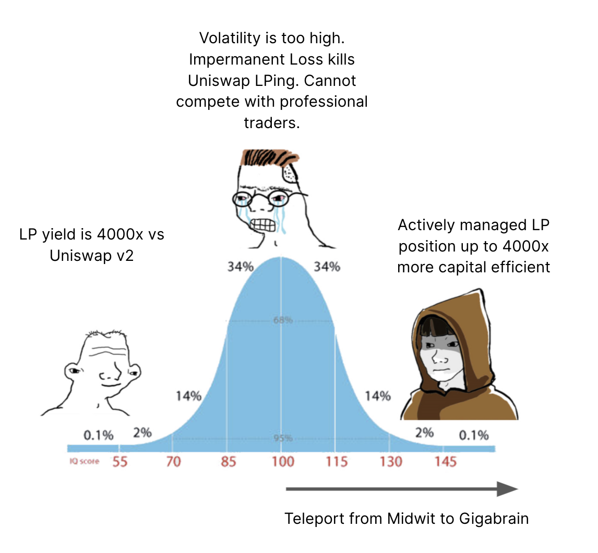

# UniCast

The UniCast project demonstrates and shares machine learning (ML) forecasting and models to Uniswap v3 and the larger Defi and web3 ecosystem.

UniCast provides the tools, building blocks and examples to build, train and serve machine learning predictions for off-chain or on-chain use using Python and open source tools.

The goal of the project is to provide these as free to use and open source examples that can be copied, improved and used as starting points for any number of other machine learning projects in web3. However, we do think that Uniswap v3 is a perfect place to start.



The initial model predicts volatility in Uniswap v3 trading pairs. One way to use these predictions is to find the Uniswap v3 LP range that maximises fees. The model will be deployed with an API that given a probability number and time period suggest a range for LP range.

For example, a user might set a target time frame of 30 days and a probability range of 90%. This means that it will give a prediction for a LP range where the price will stay within the LP range 90% of the time over the coming 30 days. This will be a much wider range than for example 7 days with a 80% probability range.

In closing, the main point of UniCast is not to provide a great model (even if we think it will be useful), but to provide tools for the community to build any number of better or worse, private or public machine learning models for use in web3.

### Test on a hosted endpoint
The Docker image below has been deployed and is available for testing. It will return the expected risk of current price moving out of the position in the set timeframe. The upp er and lower bound are expressed as a fraction of the current price, e.g. upper_bound (in USD terms) / current_price (in USD terms) gives the upper fraction. Any asset id from Coingecko can be used. This endpoint is purely for testing purposes and comes with no accuracy, uptime or performance gurantees.

```
import pickle
import requests
import json
import numpy as np

def fraction(range_bound, current_price):
    fraction = range_bound/current_price
    return fraction


url = 'http://165.227.232.84:8000/expected_timefraction'

inp = {
    "lower_bound": fraction(2276, 4553), 
    "upper_bound": fraction(9106, 4553),
    "time_horizon": 30,
    "coingecko_kwargs": {'id': 'ethereum', 'vs_currency': 'usd', 'days': '100'}
}

res = requests.post(url, headers = {'Content-type': 'application/json'}, json=inp)
print(res)
f = (json.loads(res.json())['time_fraction'])
print("Expected time fraction: ", np.round(f,3), " (chance of moving out of range in the time horizon: ", np.round(((1-np.round(f,3))*100),3), "%)")
```

### Docker Deployment tutorial
Docker can be used to deploy Unicast and create an endpoint using fast-api.  
In the project folder, build the Docker image with:
`docker build -t <your_username>/unicast .`  
Start the Docker container:
`docker run -p 8000:8000 <your_username>/unicast`
This will generate endpoints that can be called with curl or used in e.g. a python script:  `

```
import requests
import json
```
define an url the the format:  ADRESS:PORT/UNICAST-FUNCTION, here we demonstrate a local deployement
with the default port 8000 and the unicast function best_range
```
url = 'http://0.0.0.0:8000/best_range'
```
Set input values: time_fraction, time_horizon and coingecko_kwargs:
```
inp = {
    "time_fraction": 0.5, 
    "time_horizon": 30,
    "coingecko_kwargs": {'id': 'bitcoin', 'vs_currency': 'usd', 'days': '5000'}
}
```
Call the api:
```
res = json.loads(requests.post(url, headers = {'Content-type': 'application/json'}, json=inp).json())
```
this will return a json with the result value.

### About Scaleout and more info

Scaleout is building decentralized machine learning solutions. The Scaleout team is also a main contributor to the open source federated learning framework FEDn, and the resource manager STACKn.


For project updates:
Twitter (https://twitter.com/0xUnicast)
GitHub (https://github.com/unicast-project)
